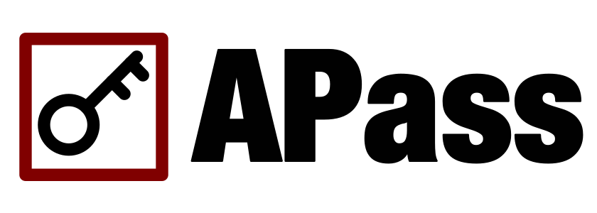
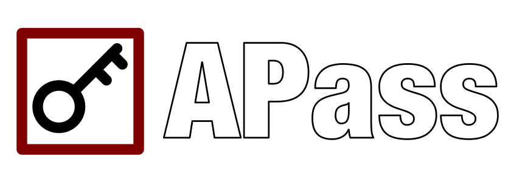
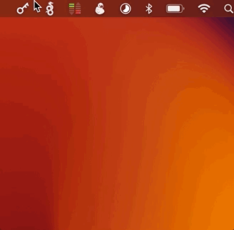
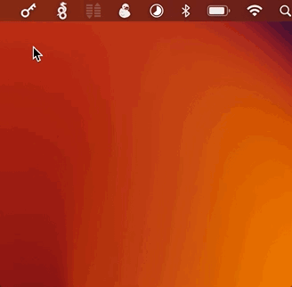
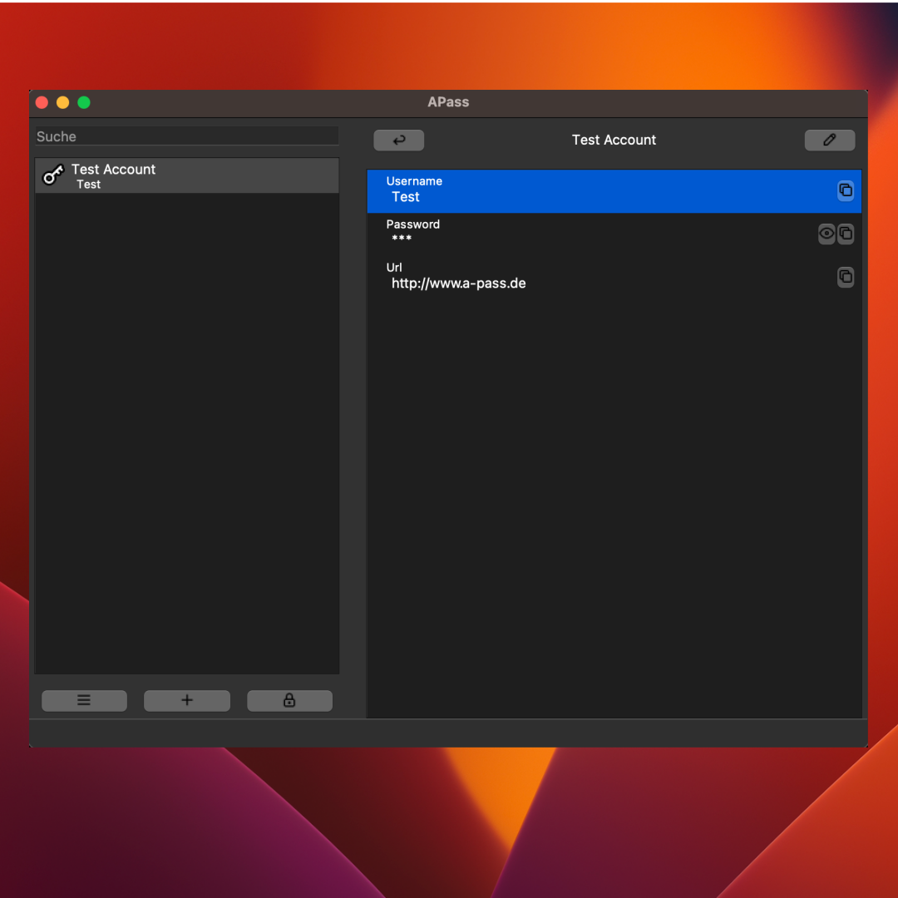
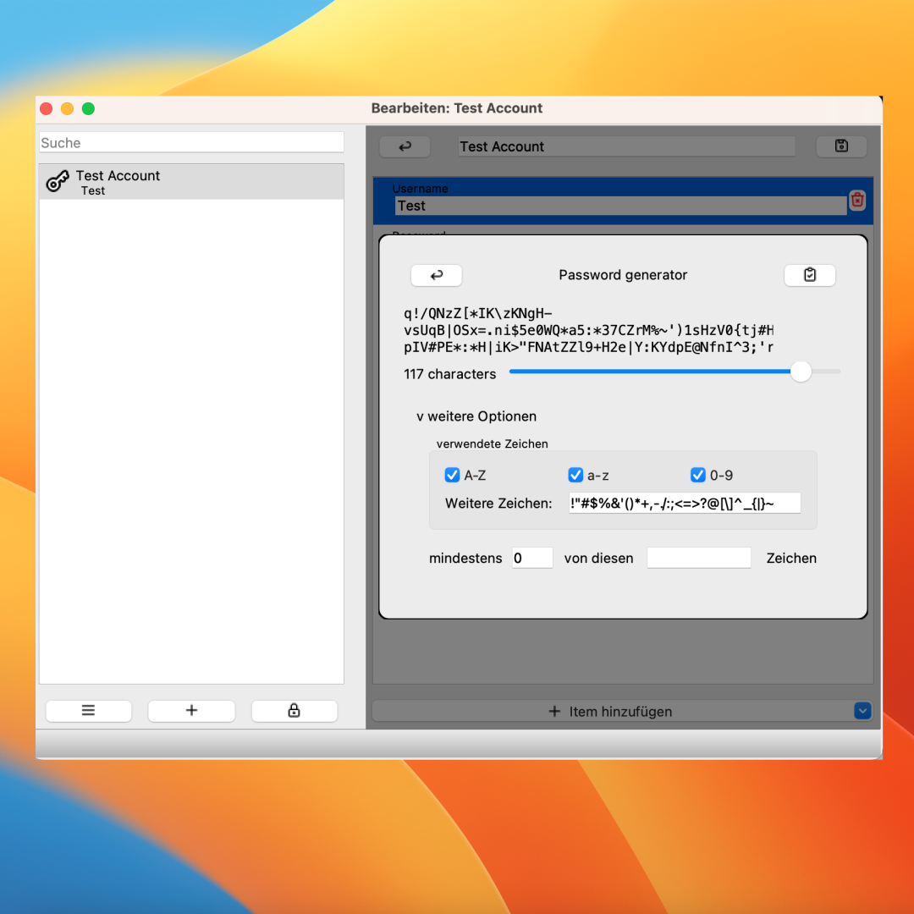

	
	

<h3 align="center">Apass a Password-Manager based on strong and open cryptography1</h3> 

so you are the only one with access to your secrets.

	
	
  <!--
  -->

Say goodbye to the hassle of remembering multiple passwords with A-Pass, the ultimate password manager. A-Pass securely stores all of your login information in one convenient location, accessible with just one master password. Say goodbye to the fear of your password being hacked and hello to the peace of mind that comes with knowing your information is safe and secure. [Try it](https://github.com/balu-/a-pass/releases) today and simplify your digital life! 

## Features

### 🔐 You own your data!
Ownership of your data is important, especially when it comes to passwords and other secrets. 
We believe that this is only possible if the software that stores it runs on your machine and keeps your data there. 
You may decide to sync and/or backup data to other places but we feel that you can only rely on a password manager that is able to fulfill its job offline.
\
**We call it the local first approach.**

### 🔐 Strong & open security by default
We are commited to keep your passwords secure, therefor 
APass is based on strong and open cryptography[^1], 
so you can trust and rely on it.
The way in which your secrets are cryped will be documented so your secrets can be restored even without APass.

### 🔐 Powerfull & Configurable Password-Generator
APass has a powerfull password-generator on board. 
It generate secure and random passwords for you, which can help you avoid using easily guessable passwords. Further its very configurable so you can specify features that a generated password should have by that you can easily meet all the password requirements.

### 🔐 Easy to use

## Get started

### ➡️ Download APass
Grab a copy of APass for your platform at the [Releases area](https://github.com/balu-/a-pass/releases)

### ➡️ Start the App & Setup your vault
On first opening, a setup wizard is started. 
It guides you through the setup process, asks you for the master password and overall gets your vault ready.

### ➡️ Enjoy
Enjoy APass. You can now add new accounts to the vault, edit or delete existing ones.
You may generate new secure passwords and directly add them to the vault.

## Download

Look at the [Releases page](https://github.com/balu-/a-pass/releases) and 
grab your copy and start using APass.

[^1]: Based on [age-encryption.org](https://age-encryption.org)

## more Images

  
  

## Sourcecode for Cli Tool in main Branch

The main branch contains the source code to interact with a apass vault on cli
